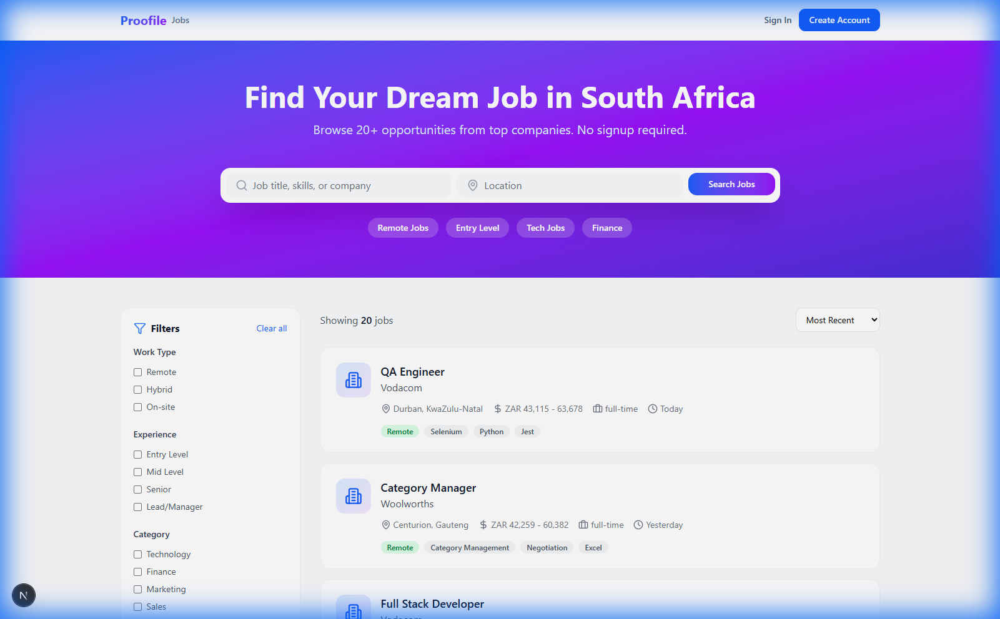
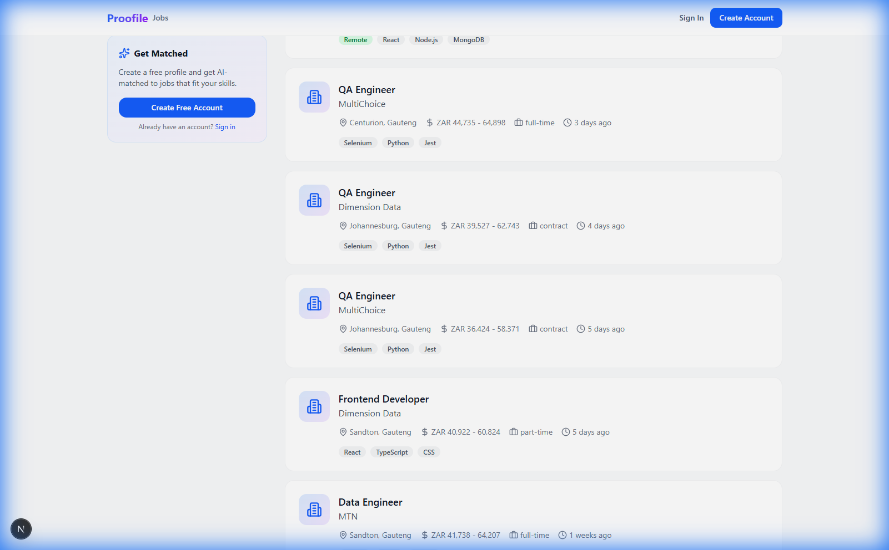

# Feed-Centric Dashboard Transformation Plan

## 🎯 Vision: Making Feed the Face of Proofile

Transform Proofile into a **feed-first professional platform** where `/feed` becomes the authenticated user's homepage — similar to how LinkedIn, Twitter/X, and Facebook center their UX around a dynamic feed.

---

## 📁 Complete Directory Structure

### Legend
- ✅ = Implemented
- 🔄 = Partially implemented
- ❌ = Not yet implemented

### Routes (Pages)

```
frontend/src/app/
├── (root)
│   └── page.tsx                    # Homepage (anonymous landing)
│
├── feed/                           # ✅ AUTHENTICATED FEED
│   ├── page.tsx                    # ✅ Three-column feed dashboard
│   └── layout.tsx                  # ✅ Feed layout with footer
│
├── portal/                         # ✅ JOBS PORTAL (Implemented)
│   ├── page.tsx                    # ✅ Public job aggregator (SEO)
│   ├── [id]/                       # ✅ Individual job pages
│   │   └── page.tsx                # ✅ Job detail (no auth required)
│   └── layout.tsx                  # ✅ Portal layout
```

### 🖼️ Current Portal Design (Implemented)

#### Hero Section & Search


#### Job Listings


**Features Implemented:**
- ✅ Search by job title, skills, or company
- ✅ Location-based filtering
- ✅ Quick filter buttons (Remote Jobs, Entry Level, Tech Jobs, Finance)
- ✅ 20 real jobs displayed from scrapers (Careers24, PNet)
- ✅ Salary display, skills, experience level
- ✅ Sign In / Create Account auth buttons

```
│
├── jobs/                           # ✅ JOB MATCHES (Authenticated)
│   ├── page.tsx                    # ✅ Personalized job matches
│   ├── [id]/                       # ✅ Job detail with match score
│   ├── agents/                     # ✅ AI agents (Hunter, etc.)
│   └── layout.tsx                  # ✅ Jobs layout
│
├── dashboard/                      # 🔄 LEGACY (redirects to /feed)
│   └── page.tsx                    # Onboarding + widgets
│
├── profile/                        # ✅ User profile
├── settings/                       # ✅ Account settings
├── explore/                        # ✅ Discover professionals
├── discover/                       # ✅ Network discovery
├── analytics/                      # ✅ Profile analytics
├── verification/                   # ✅ Identity & skill verification
├── resume/                         # ✅ Resume builder & management
└── tools/                          # ✅ AI tools
```

### Components

```
frontend/src/components/
│
├── feed/                           # FEED COMPONENTS
│   ├── index.ts                    # ✅ Central exports
│   ├── FeedCard.tsx                # ✅ Original feed card
│   ├── CreatePostComposer.tsx      # ✅ Post creation UI
│   ├── FeedLeftSidebar.tsx         # ✅ Profile summary sidebar
│   ├── FeedRightSidebar.tsx        # ✅ Agents + suggestions sidebar
│   ├── ReactionPicker.tsx          # ✅ LinkedIn-style reactions
│   ├── CommentSection.tsx          # ✅ Threaded comments
│   └── agents/                     # AGENTIC COMPONENTS
│       ├── index.ts                # ✅ Agent exports
│       ├── AgentActionBar.tsx      # ✅ AI action buttons
│       └── DraftMessageModal.tsx   # ✅ AI draft messages
│
├── jobs/                           # JOBS COMPONENTS
│   ├── ApplyModal.tsx              # ✅ Dual-path apply (new)
│   ├── agents/                     # ✅ Hunter, Tailor agents
│   ├── filters/                    # ✅ Smart filters
│   └── modals/                     # ✅ Quick apply modal
│
├── portal/                         # ✅ JOBS PORTAL COMPONENTS
│   ├── PortalJobCard.tsx           # ✅ SEO-friendly job card
│   ├── PortalSearchBar.tsx         # ✅ Anonymous search
│   ├── PortalFilters.tsx           # ✅ Category/location filters
│   └── SignupIncentive.tsx         # ✅ Conversion prompts
│
├── dashboard/                      # ✅ Dashboard widgets
├── layout/                         # ✅ Headers, navigation
├── profile/                        # ✅ Profile components
└── ui/                             # ✅ Shared UI components
```

### Middleware & Configuration

```
frontend/src/
├── middleware.ts                   # ✅ Route redirects (/dashboard → /feed)
└── ...
```

### Backend API (Python/FastAPI)

```
backend/app/
│
├── api/v1/                         # API ENDPOINTS
│   ├── feed.py                     # ✅ Feed posts & interactions
│   ├── portal.py                   # ✅ Public jobs portal (no auth)
│   ├── jobs.py                     # ✅ Job matches (authenticated)
│   ├── users.py                    # ✅ User management
│   ├── profiles.py                 # ✅ Profile data
│   ├── resumes.py                  # ✅ Resume management
│   ├── verification.py             # ✅ Identity/skill verification
│   ├── ratings.py                  # ✅ Peer ratings
│   ├── ai.py                       # ✅ AI services
│   └── agents.py                   # ✅ Agent actions
│
├── models/                         # DATABASE MODELS
│   ├── post.py                     # ✅ Feed posts
│   ├── reaction.py                 # ✅ Post reactions
│   ├── comment.py                  # ✅ Post comments
│   ├── portal_job.py               # ✅ Aggregated portal jobs
│   ├── job.py                      # ✅ Matched jobs
│   ├── user.py                     # ✅ User model
│   ├── profile.py                  # ✅ Profile model
│   ├── resume.py                   # ✅ Resume model
│   ├── verification.py             # ✅ Verification records
│   └── rating.py                   # ✅ Rating records
│
├── schemas/                        # PYDANTIC SCHEMAS
│   ├── feed.py                     # ✅ Feed DTOs
│   ├── portal.py                   # ✅ Portal DTOs
│   ├── jobs.py                     # ✅ Job DTOs
│   ├── users.py                    # ✅ User DTOs
│   └── ...
│
├── services/                       # BUSINESS LOGIC
│   ├── feed_service.py             # ✅ Feed algorithm
│   ├── portal_service.py           # ✅ Portal job aggregation
│   ├── job_matching.py             # ✅ AI job matching
│   ├── ai_service.py               # ✅ AI integrations
│   ├── agent_service.py            # ✅ Agentic actions (agents/)
│   └── ...
│
└── tasks/                          # BACKGROUND TASKS (Celery)
    ├── feed_tasks.py               # ✅ Feed processing
    ├── portal_scraper.py           # ✅ Job scraping
    ├── agent_tasks.py              # ✅ Async agent actions
    └── ...
```

### Database Schema (PostgreSQL)

```sql
-- ✅ FEED TABLES (IMPLEMENTED)
CREATE TABLE posts (
    id UUID PRIMARY KEY,
    user_id UUID REFERENCES users(id),
    type VARCHAR(50),               -- 'text', 'milestone', 'job_share', 'poll'
    content TEXT,
    visibility VARCHAR(20),         -- 'public', 'connections', 'private'
    created_at TIMESTAMP,
    updated_at TIMESTAMP
);

CREATE TABLE reactions (
    id UUID PRIMARY KEY,
    post_id UUID REFERENCES posts(id),
    user_id UUID REFERENCES users(id),
    type VARCHAR(20),               -- 'like', 'celebrate', 'support', etc.
    created_at TIMESTAMP
);

CREATE TABLE comments (
    id UUID PRIMARY KEY,
    post_id UUID REFERENCES posts(id),
    user_id UUID REFERENCES users(id),
    parent_id UUID REFERENCES comments(id),  -- For threading
    content TEXT,
    created_at TIMESTAMP
);

-- ✅ PORTAL TABLES (IMPLEMENTED)
CREATE TABLE portal_jobs (
    id UUID PRIMARY KEY,
    external_id VARCHAR(255),
    source VARCHAR(50),             -- 'pnet', 'linkedin', etc.
    title VARCHAR(255),
    company VARCHAR(255),
    location VARCHAR(255),
    salary_min DECIMAL,
    salary_max DECIMAL,
    description TEXT,
    skills TEXT[],
    posted_at TIMESTAMP,
    scraped_at TIMESTAMP,
    active BOOLEAN DEFAULT true
);

-- ✅ EXISTING TABLES
-- users, profiles, resumes, jobs, verifications, ratings, etc.
```

---

### Route Purpose Summary

| Route | Purpose | Auth Required | Status |
|-------|---------|---------------|--------|
| `/` | Homepage / Landing | No | ✅ Exists |
| `/portal` | **Jobs Portal** - Browse all jobs (SEO) | No | ✅ Done |
| `/portal/[id]` | Job detail page (anonymous) | No | ✅ Done |
| `/feed` | **Smart Feed** - Personalized dashboard | Yes | ✅ Done |
| `/jobs` | **Job Matches** - AI-matched opportunities | Yes | ✅ Exists |
| `/jobs/[id]` | Job detail with match analysis | Yes | ✅ Exists |
| `/dashboard` | Legacy dashboard (redirects to /feed) | Yes | 🔄 Redirect |

---

### User Flow

```
                             PROOFILE
                                │
            ┌───────────────────┴───────────────────┐
            │                                       │
       ANONYMOUS                               AUTHENTICATED
            │                                       │
     ┌──────┴──────┐                         ┌──────┴──────┐
     │             │                         │             │
  Homepage     /portal                    /feed        /jobs
  (Landing)    (Browse)               (Smart Feed)   (Matches)
     │             │                         │             │
     └──────┬──────┘                         └──────┬──────┘
            │                                       │
      [Apply for Job]                         [Already in]
            │
     ┌──────┴──────┐
     │             │
  Sign Up      External
  (Proofile)   (Company)
```

---

## 📊 Current State Analysis

### Current Navigation Flow
```
Login → /dashboard (widgets, resumes, AI insights)
        ├── /feed (secondary, under "More" dropdown)
        ├── /jobs
        ├── /profile
        └── etc.
```

### Current Dashboard (`/dashboard`)
- Persona selection & onboarding wizard
- Resume cards & resume tools
- AI Insights card
- Completeness widget
- Verification section
- Next step prompts

### Current Feed (`/feed`)
- Feed cards (skill verified, job match, milestone)
- Sidebar with suggested connections
- Trending jobs section
- Trending topics

---

## 🚀 Target State: Feed-First Architecture

### New Navigation Flow
```
Login → /feed (THE Dashboard - Feed + Smart Widgets)
        ├── /jobs
        ├── /profile
        ├── /explore
        ├── /tools
        └── /settings
```

### Design Inspiration
| Platform | Feed Characteristics |
|----------|---------------------|
| **LinkedIn** | Feed center, sidebar with ads/suggestions, sticky create post |
| **Twitter/X** | Feed dominant, For You/Following tabs, compose tweet prominent |
| **Facebook** | Stories at top, feed center, right sidebar with contacts |
| **Instagram** | Stories + Reels at top, infinite scroll feed |

---

## 🎭 Dual-Experience Architecture

### The Core Insight
Different user types need different experiences:

| User Type | Primary Need | Best Landing Experience |
|-----------|--------------|------------------------|
| **Anonymous** | Find jobs, discover Proofile | Jobs Portal (SEO-friendly, no friction) |
| **Authenticated** | Apply faster, grow network, track progress | Enhanced Feed (personalized, agentic) |

### Architecture Overview

```
                        proofile.co
                            │
            ┌───────────────┴───────────────┐
            │                               │
       Anonymous                       Authenticated
            │                               │
       Jobs Portal                    Smart Feed
    (SEO, browse, discover)      (Jobs + Network + Agents)
            │                               │
            └───────────────┬───────────────┘
                            │
                   Signup/Login Gate
                  (at apply or engagement)
```

### Anonymous Experience → Jobs Portal

**URL:** `proofile.co/jobs` (also promoted on homepage)

```
┌─────────────────────────────────────────────────────────────────┐
│  🔍 PROOFILE JOBS                          [Sign In] [Sign Up]  │
│  Every job in South Africa, in one place, for free.            │
│  ─────────────────────────────────────────────────────────────  │
│                                                                 │
│  Search: [Software Engineer         ] [Johannesburg ▼] [🔍]    │
│                                                                 │
│  Featured | Remote | Tech | Finance | Marketing | More ▼        │
│  ─────────────────────────────────────────────────────────────  │
│                                                                 │
│  ┌─────────────────────────────────────────────────────────┐   │
│  │ 🏢 Senior React Developer                                │   │
│  │ Stripe • Remote • R850k-R1.2M • 2 days ago               │   │
│  │ React, TypeScript, Node.js                               │   │
│  │ [Apply →] [Save ♡]                                        │   │
│  └─────────────────────────────────────────────────────────┘   │
│                                                                 │
│  ┌─────────────────────────────────────────────────────────┐   │
│  │ 🏢 Product Manager                                        │   │
│  │ Takealot • Cape Town • R600k-R800k • 5 days ago          │   │
│  │ Agile, Roadmapping, Analytics                            │   │
│  │ [Apply →] [Save ♡]                                        │   │
│  └─────────────────────────────────────────────────────────┘   │
│                                                                 │
│  💡 TIP: Verified profiles get 3x more recruiter responses     │
│  [Learn About Verification →]                                   │
└─────────────────────────────────────────────────────────────────┘
```

**Key Features:**
- No signup required to browse/search
- Full job details visible
- Click "Apply" → Signup modal with choice
- SEO-optimized (each job = 1 indexed page)
- Subtle verification upsell

**Conversion Point:**
```
┌─────────────────────────────────────────────────────────────────┐
│  How would you like to apply?                                   │
│  ─────────────────────────────────────────────────────────────  │
│                                                                 │
│  ┌─────────────────────────────────────────────────────────┐   │
│  │ ⚡ QUICK APPLY WITH PROOFILE           [Recommended]     │   │
│  │                                                          │   │
│  │ • One-click apply with verified profile                  │   │
│  │ • AI tailors your resume automatically                   │   │
│  │ • Track all applications in one place                    │   │
│  │                                                          │   │
│  │ [Create Free Account →]                                  │   │
│  └─────────────────────────────────────────────────────────┘   │
│                                                                 │
│  ┌─────────────────────────────────────────────────────────┐   │
│  │ 🔗 Apply on Company Website                              │   │
│  │                                                          │   │
│  │ [Go to Stripe Careers →]                                 │   │
│  └─────────────────────────────────────────────────────────┘   │
└─────────────────────────────────────────────────────────────────┘
```

---

### Authenticated Experience → Enhanced Feed

**URL:** `proofile.co/feed` (default after login)

```
┌────────────────────────────────────────────────────────────────────────────────┐
│                               PROOFILE FEED                                    │
├──────────────────┬───────────────────────────────────────┬─────────────────────┤
│  👤 YOUR ORBIT   │        📡 YOUR PERSONALIZED FEED       │   🤖 AGENT HQ       │
│                  │                                        │                     │
│ ┌──────────────┐ │  ┌────────────────────────────────────┐│ ┌─────────────────┐ │
│ │ John Doe     │ │  │ ✍️ What's happening?                ││ │ 🎯 HUNTER AGENT │ │
│ │ Sr. Engineer │ │  │ [Post Update] [Share Job] [Poll]   ││ │ Scanning...     │ │
│ │ 🛡️ 87% Trust │ │  └────────────────────────────────────┘│ │ 5 new matches   │ │
│ └──────────────┘ │                                        │ │ [View Jobs →]   │ │
│                  │  ┌────────────────────────────────────┐│ └─────────────────┘ │
│ ┌──────────────┐ │  │ 🎯 TOP MATCH (94%)                  ││                     │
│ │ Profile: 85% │ │  │ Staff Engineer @ Vercel             ││ ┌─────────────────┐ │
│ │ ████████░░   │ │  │ Remote • $180k-220k • Posted today  ││ │ 📝 TAILOR AGENT │ │
│ │ [Complete →] │ │  │                                      ││ │ Resume ready    │ │
│ └──────────────┘ │  │ 🤖 "Your React + Next.js verified   ││ │ for 3 jobs      │ │
│                  │  │     skills match this role"          ││ │ [Preview →]     │ │
│ ┌──────────────┐ │  │                                      ││ └─────────────────┘ │
│ │ Applications │ │  │ [📝 Draft Cover] [📄 Tailor Resume] ││                     │
│ │ 12 active    │ │  │ [🚀 Quick Apply]                     ││ ┌─────────────────┐ │
│ │ 3 interviews │ │  └────────────────────────────────────┘│ │ 📊 INSIGHTS     │ │
│ │ [View All]   │ │                                        │ │ 234 profile views│ │
│ └──────────────┘ │  ┌────────────────────────────────────┐│ │ +15% this week  │ │
│                  │  │ ✅ Sarah Chen earned verification   ││ └─────────────────┘ │
│ Quick Actions:   │  │ "Staff-Level Engineering" verified  ││                     │
│ [Update Resume]  │  │ by Stripe HR                        ││ ┌─────────────────┐ │
│ [Get Verified]   │  │                                      ││ │ 👥 SUGGESTED    │ │
│ [Browse Jobs]    │  │ [🎉 Congratulate] [View Profile]    ││ │ • Alex R. 92%   │ │
│                  │  └────────────────────────────────────┘│ │ • Jordan K. 88% │ │
│                  │                                        │ │ [Connect]       │ │
│                  │  ┌────────────────────────────────────┐│ └─────────────────┘ │
│                  │  │ 💼 12 NEW JOBS match your skills    ││                     │
│                  │  │ Based on: React, TS, Node (verified)││                     │
│                  │  │ [View All Matches →]                ││                     │
│                  │  └────────────────────────────────────┘│                     │
└──────────────────┴───────────────────────────────────────┴─────────────────────┘
```

**Key Differentiators from Jobs Portal:**

| Feature | Jobs Portal (Anonymous) | Enhanced Feed (Auth) |
|---------|------------------------|---------------------|
| Job Display | All jobs, generic | Personalized, match-scored |
| Actions | Apply (external) | Draft, Tailor, Quick Apply |
| Agents | None | Hunter, Tailor, Network |
| Network | None | Verification updates, connections |
| Tracking | None | Applications, interviews, responses |
| Profile | None | Completeness, Trust Score, Stats |

---

### Navigation Logic

```typescript
// middleware.ts or layout.tsx
export function middleware(request: NextRequest) {
  const isAuthenticated = checkAuth(request);
  const pathname = request.nextUrl.pathname;
  
  // Root redirect logic
  if (pathname === '/') {
    if (isAuthenticated) {
      return NextResponse.redirect('/feed');  // Authenticated → Feed
    } else {
      return NextResponse.next();  // Anonymous → Homepage/Jobs
    }
  }
  
  // Old dashboard redirect
  if (pathname === '/dashboard') {
    return NextResponse.redirect('/feed');
  }
  
  // Feed requires auth
  if (pathname === '/feed' && !isAuthenticated) {
    return NextResponse.redirect('/jobs');  // Redirect to Jobs Portal
  }
}
```

---

### Content Types by Experience

#### Anonymous Feed (Jobs Portal):
- Job listings (all sources)
- Featured/sponsored jobs
- Category browsing
- Location-based search
- Salary filters

#### Authenticated Feed (Enhanced):
- **Matched Jobs** (with AI match scores)
- **Verification Milestones** (from network)
- **Application Updates** (status changes)
- **Agent Suggestions** (draft, apply, connect)
- **Profile Prompts** (complete verification, update resume)
- **Network Activity** (new connections, endorsements)

---

### Signup Incentives

To convert anonymous → authenticated, show value props at key moments:

```
┌─────────────────────────────────────────────────────────────────┐
│  🔓 UNLOCK PROOFILE (Free)                                      │
│  ─────────────────────────────────────────────────────────────  │
│                                                                 │
│  ✓ See your match score for every job                          │
│  ✓ AI drafts your cover letters                                │
│  ✓ Track all applications in one place                         │
│  ✓ Get notified when jobs match your skills                    │
│  ✓ Verified profiles get 3x more responses                     │
│                                                                 │
│  [Create Free Account] or [Sign in with Google]                 │
└─────────────────────────────────────────────────────────────────┘
```

---

## 🏗️ Implementation Phases

### Phase 1: Feed Page Enhancement (Week 1)

#### 1.1 Create Post Composer
```
┌─────────────────────────────────────────────────────────┐
│ ┌──────┐  What's on your professional mind?             │
│ │Avatar│  ────────────────────────────────────          │
│ └──────┘  [📷 Media] [📊 Poll] [🎉 Milestone] [💼 Job]  │
└─────────────────────────────────────────────────────────┘
```

**Files to Create:**
- `frontend/src/components/feed/CreatePostComposer.tsx`
- `frontend/src/components/feed/PostTypeSelector.tsx`

**Post Types:**
1. **Text Update** - Professional thoughts, insights
2. **Milestone** - Career achievements, verifications
3. **Job Alert** - Share job opportunities
4. **Poll** - Professional opinion polls
5. **Article** - Long-form content (future)

#### 1.2 Feed Algorithm Intelligence
**Backend Enhancements:**
- `backend/app/api/v1/endpoints/feed.py`
- `backend/app/services/feed_service.py`
- `backend/app/models/feed.py`

**Feed Ranking Factors:**
- Recency (decay function)
- User engagement (likes, comments)
- Connection strength
- Content relevance to user's industry
- Verification status of poster

#### 1.3 Real-time Updates
- WebSocket integration for live feed updates
- "New posts available" notification banner
- Pull-to-refresh on mobile

---

### Phase 2: Dashboard Widgets Merge (Week 2)

#### 2.1 Left Sidebar (User Context)
```
┌───────────────────────┐
│    👤 Profile Card    │
│  ══════════════════   │
│  John Doe             │
│  Software Engineer    │
│  ────────────────     │
│  Profile: 85% ████░   │
│  Verification: ✓✓✓○○  │
│                       │
│  📊 Quick Stats       │
│  • 234 views          │
│  • 12 connections     │
│  • 5 job matches      │
└───────────────────────┘
```

**Migrate from Dashboard:**
- Profile completeness widget → Left sidebar
- Verification status summary → Left sidebar
- Quick stats → Left sidebar

#### 2.2 Right Sidebar (Discovery & Actions)
```
┌───────────────────────┐
│  🔥 Trending Now      │
│  #AIJobs #RemoteWork  │
│                       │
│  👥 People to Follow  │
│  • Sarah Chen 92%     │
│  • Marcus J. 88%      │
│                       │
│  💼 Jobs For You      │
│  • Senior Dev @Stripe │
│  • PM @Notion         │
│                       │
│  🎯 Quick Actions     │
│  [Update Resume]      │
│  [Get Verified]       │
│  [Browse Jobs]        │
└───────────────────────┘
```

**Migrate from Dashboard:**
- AI Insights → Right sidebar "Insights" card
- Resume quick access → Right sidebar action
- Job recommendations → Right sidebar

---

### Phase 3: Stories & Status Updates (Week 3)

#### 3.1 Professional Stories
```
┌─────────────────────────────────────────────┐
│ ┌──┐ ┌──┐ ┌──┐ ┌──┐ ┌──┐ ┌──┐ ┌──┐         │
│ │+Y│ │SC│ │MJ│ │EW│ │AR│ │JK│ │→ │ ←scroll │
│ │ou│ │○ │ │○ │ │○ │ │○ │ │○ │ │  │         │
│ └──┘ └──┘ └──┘ └──┘ └──┘ └──┘ └──┘         │
└─────────────────────────────────────────────┘
```

**Story Types:**
- Profile view milestones
- New verification badges
- Job search status updates
- Skill endorsements received
- Work anniversary

**Files to Create:**
- `frontend/src/components/feed/StoriesBar.tsx`
- `frontend/src/components/feed/StoryViewer.tsx`
- `backend/app/models/story.py`

#### 3.2 Status Indicators
- 🟢 Open to Work
- 💼 Hiring
- 🎓 Learning
- 🔍 Looking for Opportunities

---

### Phase 4: Enhanced Feed Cards (Week 4)

#### 4.1 Rich Post Types
| Type | Visual |
|------|--------|
| **Verification** | Badge animation + confetti |
| **Job Match** | Company logo + match score |
| **Milestone** | Trophy icon + celebration |
| **Poll** | Interactive vote bars |
| **Article** | Cover image + preview |

#### 4.2 Engagement Features
- Reactions (Like, Celebrate, Support, Insightful, Curious)
- Threaded comments with mentions
- Share to profile/external
- Save/bookmark posts
- Report inappropriate content

**Files to Modify:**
- `frontend/src/components/feed/FeedCard.tsx` → Enhanced reactions
- `frontend/src/components/feed/CommentSection.tsx` → New component
- `frontend/src/components/feed/ShareModal.tsx` → New component

---

### Phase 4.5: Agentic Feed Cards (Week 4-5) 🤖

> **The Future of Feed: Cards That Do Work For You**

Traditional feed cards are **passive** — users can only Like or Comment. Agentic feed cards are **active** — they suggest and execute actions based on AI analysis.

#### 4.5.1 The Agent Layer Concept

Every feed card becomes an **action hub** powered by Proofile's AI agents:

```
┌─────────────────────────────────────────────────────────────────┐
│  👤 Sarah Chen (Verified CTO) posted a job                      │
│  ─────────────────────────────────────────────────────────────  │
│  🚀 Stripe is hiring Senior React Engineers                     │
│                                                                 │
│  ┌─────────────────────────────────────────────────────────┐   │
│  │ 🤖 TAILOR AGENT                                          │   │
│  │ "Your verified React skills match this role 94%"         │   │
│  │                                                          │   │
│  │ [📝 Draft Cover Letter] [📄 Tailor Resume] [🚀 Apply]    │   │
│  └─────────────────────────────────────────────────────────┘   │
│                                                                 │
│  ♥️ 42  💬 8  ↗️ Share                                          │
└─────────────────────────────────────────────────────────────────┘
```

#### 4.5.2 Agentic Card Types

| Card Type | Agent | Action Buttons |
|-----------|-------|----------------|
| **Job Match** | Tailor Agent | `[Draft Cover Letter]` `[Tailor Resume]` `[Apply Now]` |
| **Skill Milestone** | Hunter Agent | `[Find Jobs Using This Skill]` `[Add to Resume]` |
| **Connection Post** | Network Agent | `[Draft Congrats]` `[Schedule Coffee Chat]` |
| **Learning Content** | Growth Agent | `[Add to Learning Path]` `[Set Reminder]` |
| **Verification** | Trust Agent | `[Get Similar Verification]` `[View Trust Score]` |

#### 4.5.3 Implementation Details

**New Component Structure:**
```
frontend/src/components/feed/agents/
├── AgentActionBar.tsx          # Container for agent actions
├── TailorAgentCard.tsx         # Job-specific actions
├── HunterAgentCard.tsx         # Job discovery actions
├── NetworkAgentCard.tsx        # Connection actions
├── GrowthAgentCard.tsx         # Learning actions
└── DraftMessageModal.tsx       # AI-drafted message preview
```

**Example: Job Match Card with Agent Actions**
```typescript
// AgentActionBar.tsx
interface AgentAction {
  id: string;
  label: string;
  icon: React.ReactNode;
  agentType: 'tailor' | 'hunter' | 'network' | 'growth';
  onClick: () => void;
  aiPreview?: string; // Pre-generated AI content
}

function AgentActionBar({ post, user }: Props) {
  const actions = useMemo(() => {
    if (post.type === 'job_match') {
      return [
        {
          id: 'draft-cover',
          label: 'Draft Cover Letter',
          icon: <FileText />,
          agentType: 'tailor',
          aiPreview: generateCoverLetter(post.job, user.profile),
        },
        {
          id: 'tailor-resume',
          label: 'Tailor Resume',
          icon: <FileCheck />,
          agentType: 'tailor',
          onClick: () => router.push(`/resume/tailor?job=${post.job.id}`),
        },
        {
          id: 'apply',
          label: 'Apply Now',
          icon: <Send />,
          agentType: 'tailor',
          onClick: () => handleQuickApply(post.job),
        },
      ];
    }
    // ... other post types
  }, [post, user]);

  return (
    <div className="bg-gradient-to-r from-indigo-50 to-purple-50 dark:from-indigo-900/20 dark:to-purple-900/20 rounded-xl p-4 mt-4 border border-indigo-100 dark:border-indigo-800">
      <div className="flex items-center gap-2 text-sm text-indigo-700 dark:text-indigo-300 mb-3">
        <Bot className="w-4 h-4" />
        <span className="font-medium">Tailor Agent</span>
        <span className="text-indigo-500">•</span>
        <span>{actions[0].aiPreview?.slice(0, 50)}...</span>
      </div>
      <div className="flex flex-wrap gap-2">
        {actions.map(action => (
          <Button 
            key={action.id}
            variant="outline" 
            size="sm"
            className="bg-white dark:bg-gray-800"
            onClick={action.onClick}
          >
            {action.icon}
            {action.label}
          </Button>
        ))}
      </div>
    </div>
  );
}
```

#### 4.5.4 AI Draft Previews

When user clicks "Draft Cover Letter", show a modal with AI-generated content:

```
┌─────────────────────────────────────────────────────────────────┐
│  📝 AI-Drafted Cover Letter                              [X]   │
│  ─────────────────────────────────────────────────────────────  │
│                                                                 │
│  Dear Hiring Manager,                                           │
│                                                                 │
│  I'm excited to apply for the Senior React Engineer position    │
│  at Stripe. With 5 years of verified React experience and       │
│  a 92% skill match score, I believe I'd be a strong fit...      │
│                                                                 │
│  [Based on your verified skills: React, TypeScript, Node.js]    │
│                                                                 │
│  ─────────────────────────────────────────────────────────────  │
│              [✏️ Edit] [📋 Copy] [📧 Send via Email]            │
└─────────────────────────────────────────────────────────────────┘
```

#### 4.5.5 Backend API for Agent Actions

```python
# backend/app/api/v1/endpoints/agent_actions.py

@router.post("/feed/{post_id}/agent-action")
async def execute_agent_action(
    post_id: int,
    action: AgentActionRequest,
    current_user: User = Depends(get_current_user),
    ai_service: AIService = Depends(get_ai_service),
):
    """Execute an AI agent action on a feed post"""
    
    post = await get_post(post_id)
    
    if action.type == "draft_cover_letter":
        content = await ai_service.generate_cover_letter(
            user=current_user,
            job=post.job_data,
            verified_skills=current_user.verified_skills,
        )
        return {"draft": content, "editable": True}
    
    elif action.type == "draft_congratulations":
        content = await ai_service.generate_congrats_message(
            sender=current_user,
            recipient=post.user,
            milestone=post.milestone_data,
        )
        return {"draft": content, "send_options": ["dm", "comment", "email"]}
    
    # ... other action types
```

#### 4.5.6 Why This Matters

| Traditional Feed | Agentic Feed |
|-----------------|--------------|
| "Here is a job posting" | "Here is a job + I drafted your application" |
| "Someone got promoted" | "Congrats message ready to send" |
| "Article about TypeScript" | "Add TypeScript to your learning path?" |
| User does all the work | AI does the work, user approves |

**Result:** Feed becomes a **productivity tool**, not just an information stream.

---

### Phase 5: Route Restructuring (Week 5)

#### 5.1 URL Changes
| Old Route | New Route | Purpose |
|-----------|-----------|---------|
| `/dashboard` | `/feed` | Main authenticated home |
| `/feed` | (merged) | Deprecated, redirect |

#### 5.2 Navigation Updates
```typescript
// navigation.tsx updates
export const PRIMARY_NAV_ITEMS = [
  { label: "Home", href: "/feed", icon: <Home /> },  // Changed from /dashboard
  { label: "Jobs", href: "/jobs", icon: <Briefcase /> },
  { label: "Profile", href: "/profile", icon: <User /> },
  { label: "Tools", href: "/tools", icon: <Wrench /> },
];
```

#### 5.3 Redirect Logic
```typescript
// middleware.ts or layout.tsx
if (pathname === '/dashboard') {
  redirect('/feed');
}
```

**Files to Modify:**
- `frontend/src/config/navigation.tsx`
- `frontend/src/app/dashboard/page.tsx` → Redirect component
- `frontend/src/middleware.ts` → Add redirect rule

---

### Phase 6: Onboarding Integration (Week 6)

#### 6.1 First-Time User Experience
- Show onboarding wizard as modal overlay on feed
- Pre-populate feed with "getting started" content
- Progressive disclosure of features

#### 6.2 Empty State Feed
```
┌─────────────────────────────────────────────┐
│           Welcome to Proofile! 👋           │
│                                             │
│  Your feed is empty. Let's fix that:        │
│                                             │
│  1. ✓ Create your profile                   │
│  2. ○ Get verified                          │
│  3. ○ Follow 5 professionals                │
│  4. ○ Share your first update               │
│                                             │
│         [Complete Profile →]                │
└─────────────────────────────────────────────┘
```

---

## 📁 File Structure Changes

### New Components
```
frontend/src/components/feed/
├── CreatePostComposer.tsx      # NEW - Post creation
├── PostTypeSelector.tsx        # NEW - Post type buttons
├── StoriesBar.tsx              # NEW - Stories carousel
├── StoryViewer.tsx             # NEW - Story modal
├── CommentSection.tsx          # NEW - Threaded comments
├── ShareModal.tsx              # NEW - Share options
├── ReactionPicker.tsx          # NEW - Emoji reactions
├── FeedLeftSidebar.tsx         # NEW - Profile summary
├── FeedRightSidebar.tsx        # NEW - Suggestions
├── FeedCard.tsx                # MODIFY - Enhanced with agent actions
├── FeedCardSkeleton.tsx        # NEW - Loading state
└── agents/                     # NEW - Agentic UI components
    ├── AgentActionBar.tsx      # Agent action container
    ├── TailorAgentCard.tsx     # Job application actions
    ├── HunterAgentCard.tsx     # Job discovery actions
    ├── NetworkAgentCard.tsx    # Connection/messaging actions
    ├── GrowthAgentCard.tsx     # Learning path actions
    └── DraftMessageModal.tsx   # AI draft preview modal
```

### Backend API Endpoints
```
backend/app/api/v1/endpoints/
├── feed.py                     # MODIFY - Enhanced
├── posts.py                    # NEW - Post CRUD
├── stories.py                  # NEW - Stories API
├── reactions.py                # NEW - Reactions API
├── comments.py                 # NEW - Comments API
└── agent_actions.py            # NEW - AI agent actions (draft, apply, etc.)
```

### Database Models
```
backend/app/models/
├── post.py                     # NEW
├── story.py                    # NEW
├── reaction.py                 # NEW
├── comment.py                  # NEW
└── feed_settings.py            # NEW - User feed prefs
```

---

## 🔨 Technical Implementation Details

### Database Schema
```sql
-- Posts table
CREATE TABLE posts (
    id SERIAL PRIMARY KEY,
    user_id INTEGER REFERENCES users(id),
    content TEXT NOT NULL,
    post_type VARCHAR(50), -- 'text', 'milestone', 'poll', 'job_share'
    media_urls JSONB,
    poll_data JSONB,
    visibility VARCHAR(20) DEFAULT 'public',
    likes_count INTEGER DEFAULT 0,
    comments_count INTEGER DEFAULT 0,
    shares_count INTEGER DEFAULT 0,
    created_at TIMESTAMP DEFAULT NOW(),
    updated_at TIMESTAMP
);

-- Stories table
CREATE TABLE stories (
    id SERIAL PRIMARY KEY,
    user_id INTEGER REFERENCES users(id),
    story_type VARCHAR(50),
    content JSONB,
    expires_at TIMESTAMP, -- 24 hours
    views_count INTEGER DEFAULT 0,
    created_at TIMESTAMP DEFAULT NOW()
);

-- Reactions table
CREATE TABLE reactions (
    id SERIAL PRIMARY KEY,
    user_id INTEGER REFERENCES users(id),
    post_id INTEGER REFERENCES posts(id),
    reaction_type VARCHAR(20), -- 'like', 'celebrate', 'support', 'insightful', 'curious'
    created_at TIMESTAMP DEFAULT NOW(),
    UNIQUE(user_id, post_id)
);

-- Comments table
CREATE TABLE comments (
    id SERIAL PRIMARY KEY,
    user_id INTEGER REFERENCES users(id),
    post_id INTEGER REFERENCES posts(id),
    parent_id INTEGER REFERENCES comments(id), -- For threads
    content TEXT NOT NULL,
    likes_count INTEGER DEFAULT 0,
    created_at TIMESTAMP DEFAULT NOW()
);
```

### Feed Algorithm (Python)
```python
def calculate_feed_score(post, user):
    """Calculate post ranking score for user's feed"""
    
    # Base score from engagement
    engagement_score = (
        post.likes_count * 1.0 +
        post.comments_count * 2.0 +
        post.shares_count * 3.0
    )
    
    # Recency decay (half-life of 24 hours)
    hours_old = (datetime.now() - post.created_at).total_seconds() / 3600
    recency_score = math.exp(-hours_old / 24)
    
    # Connection strength bonus
    connection_score = get_connection_strength(user.id, post.user_id)
    
    # Industry relevance
    relevance_score = calculate_industry_relevance(user, post)
    
    # Verification trust bonus
    trust_score = 1.5 if post.user.is_verified else 1.0
    
    return (
        engagement_score * 0.3 +
        recency_score * 0.25 +
        connection_score * 0.2 +
        relevance_score * 0.15 +
        trust_score * 0.1
    )
```

---

## 📲 Responsive Design

### Mobile Layout
```
┌─────────────────────┐
│  ○ Stories ○ ○ ○ →  │
├─────────────────────┤
│  For You | Following│
├─────────────────────┤
│  ┌─────────────────┐│
│  │   Feed Card 1   ││
│  └─────────────────┘│
│  ┌─────────────────┐│
│  │   Feed Card 2   ││
│  └─────────────────┘│
├─────────────────────┤
│ 🏠 💼 ➕ 🔔 👤     │  ← Bottom nav
└─────────────────────┘
```

### Desktop Layout (3-Column)
```
┌────────┬──────────────────────────┬────────┐
│ Left   │     Center (Feed)        │ Right  │
│ Side   │ ┌────────────────────┐   │ Side   │
│        │ │ Create Post...     │   │        │
│ Profile│ └────────────────────┘   │ Trends │
│ Stats  │ ┌────────────────────┐   │        │
│        │ │ Feed Card 1        │   │ People │
│        │ └────────────────────┘   │        │
│        │ ┌────────────────────┐   │ Jobs   │
│        │ │ Feed Card 2        │   │        │
│        │ └────────────────────┘   │        │
└────────┴──────────────────────────┴────────┘
```

---

## ✅ Success Metrics

### Engagement KPIs
- **Feed scroll depth** - Average % of feed viewed
- **Time on feed** - Minutes spent on feed page
- **Post creation rate** - Posts per user per week
- **Engagement rate** - Likes/comments per post
- **Return visits** - Users returning to feed daily

### Technical KPIs
- **Feed load time** < 1.5s
- **Infinite scroll performance** - Smooth 60fps
- **API response time** < 200ms
- **WebSocket connection stability** > 99%

---

## 🚧 Migration Strategy

### Step 1: Feature Parity
1. Build enhanced feed with all dashboard widgets
2. Deploy as `/feed-v2` for internal testing
3. A/B test with 10% of users

### Step 2: Gradual Rollout
1. Make `/feed` the new default for new users
2. Add "Try New Dashboard" banner for existing users
3. Monitor metrics and gather feedback

### Step 3: Full Migration
1. Redirect `/dashboard` → `/feed`
2. Keep old dashboard accessible at `/dashboard/classic` for 30 days
3. Remove legacy code after migration period

---

## 📅 Timeline

| Week | Phase | Deliverables |
|------|-------|--------------|
| 1 | Feed Enhancement | Create post composer, post types |
| 2 | Widget Merge | Left/right sidebars, migrate dashboard widgets |
| 3 | Stories | Stories bar, status indicators |
| 4 | Enhanced Cards | Reactions, comments, rich post types |
| 4-5 | **🤖 Agentic Cards** | **Agent action bar, draft modals, AI integration** |
| 5-6 | Route Changes | URL restructuring, navigation updates |
| 6-7 | Onboarding | Empty states, first-time UX |
| 8 | Testing | QA, performance optimization |
| 9 | Rollout | Gradual migration, monitoring |

---

## 🎨 Design System Updates

### New Components Needed
- `StoryAvatar` - Circular avatar with story ring
- `ReactionButton` - Animated reaction picker
- `ComposerInput` - Rich text editor
- `PollCreator` - Poll builder interface
- `MediaUploader` - Image/video upload

### Animation Guidelines
- Story ring: Rainbow gradient rotation
- Reactions: Pop-in with scale animation
- New posts: Slide down from top
- Like button: Heart burst animation

---

## 🔒 Security Considerations

- Rate limiting on post creation (max 10/hour)
- Content moderation for text posts
- Image scanning for inappropriate content
- Report/block functionality
- Privacy controls for posts (public/connections/private)

---

## 📚 References

- [LinkedIn Feed Architecture](https://engineering.linkedin.com/blog/2022/feed-systems)
- [Twitter Timeline Algorithm](https://blog.twitter.com/engineering)
- [Facebook News Feed Ranking](https://about.fb.com/news/2021/01/how-news-feed-works/)

---

## ✅ Implementation Status (December 2025)

### Core Infrastructure: COMPLETE

| Component | Files | Status |
|-----------|-------|--------|
| **Feed API** | `api/v1/feed.py`, `api/v1/social.py` | ✅ Done |
| **Post Models** | `models/post.py`, `models/reaction.py`, `models/comment.py` | ✅ Done |
| **Feed Service** | `services/feed_service.py` | ✅ Done |
| **Portal API** | `api/v1/portal.py` | ✅ Done |
| **Portal Service** | `services/portal_service.py` | ✅ Done |
| **Portal Jobs Model** | `models/portal_job.py` | ✅ Done |
| **Job Scrapers** | `tasks/portal_scraper.py` | ✅ Done |

### Frontend Components: COMPLETE

| Component | Path | Status |
|-----------|------|--------|
| **Feed Page** | `app/feed/page.tsx` | ✅ Done |
| **Post Composer** | `components/feed/CreatePostComposer.tsx` | ✅ Done |
| **Feed Cards** | `components/feed/FeedCard.tsx` | ✅ Done |
| **Reactions** | `components/feed/ReactionPicker.tsx` | ✅ Done |
| **Comments** | `components/feed/CommentSection.tsx` | ✅ Done |
| **Left Sidebar** | `components/feed/FeedLeftSidebar.tsx` | ✅ Done |
| **Right Sidebar** | `components/feed/FeedRightSidebar.tsx` | ✅ Done |
| **Agent Actions** | `components/feed/agents/` | ✅ Done |
| **Portal Page** | `app/portal/page.tsx` | ✅ Done |
| **Portal Cards** | `components/portal/PortalJobCard.tsx` | ✅ Done |
| **Portal Filters** | `components/portal/PortalFilters.tsx` | ✅ Done |
| **Signup Incentive** | `components/portal/SignupIncentive.tsx` | ✅ Done |

### Future Enhancements

| Feature | Priority | Description |
|---------|----------|-------------|
| Stories Bar | Low | Instagram-style professional stories |
| Poll Posts | Low | Create polls in feed |
| WebSocket Live Updates | Medium | Real-time feed updates |
| Mobile Bottom Nav | Low | Mobile-optimized navigation |

---

*This plan transforms Proofile from a utility dashboard into a social-first professional platform, increasing engagement and user retention.*
